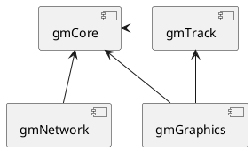
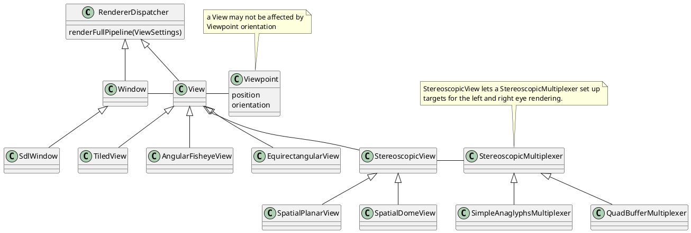

# gramods

# Table of Content

1. [Introduction](#introduction)
     1. [Purpose](#purpose)
     2. [Repository Structure](#repository-structure)
2. [Build and Install](#build-and-install)
3. [Modules and Dependencies](#modules-and-dependencies)
     1. [gmCore](#gmcore)
     2. [gmTrack](#gmtrack)
     3. [gmNetwork](#gmnetwork)
     4. [gmGraphics](#gmgraphics)
     5. [gmTouch](#gmtouch)
     6. [gmMisc](#gmmisc)


# Introduction

Gramods, short for Graphics Modules, is a collection of weakly inter dependent and useful APIs for Virtual Reality and graphics cluster rendering.


## Purpose

The main purpose of the Gramods library is to simplify loading of platform dependent configurations into a pre-compiled application, while also simplifying the implementation of such applications. The aim is to be able to implement an application that employs execution and data synchronization over network and synchronized multi window rendering in a flexible and configurable way, similar to this example code:

```c++
int main(int argc, char *argv[]) {

  gmCore::Configuration config(argc, argv);

  std::shared_ptr<gmNetwork::ExecutionSynchronization> sync;
  if (! config.getObject(sync)) {
    GM_ERR("main", "Cannot run without cluster synchronization settings!");
    return -1;
  }

  std::vector<std::shared_ptr<gmGraphics::Window>> windows;
  config->getAllObjects(windows);
  if (windows.empty()) {
    GM_ERR("main", "Cannot run without graphics pipeline!");
    return -1;
  }

  GM_INF("main", "Configuration loaded");

  std::shared_ptr<gmTrack::SinglePoseTracker> head_tracker;
  config.getObject("head tracker", head_tracker);
  GM_INF("main", "Head tracker: " << head_tracker);

  std::shared_ptr<gmTrack::Controller> wand_primary;
  config.getObject("primary controller", wand_primary);
  GM_INF("main", "Primary controller: " << wand_primary);

  ...

  graphics->callOnceWithGLContext([=] (gmGraphics::FrameData info) {
      myInitFunction(info.getGLContextIndex());
    });

  bool alive = true;
  while (alive) {

    alive = false;
    for (auto window : windows) {

      window->processEvents();
      if (!window->isOpen()) continue;

      window->renderFullPipeline();
      window->swap();

      alive |= true;
    }

    Updateable::updateAll();
  }
```


## Repository Structure

The repository divides the software into *modules* and *apps* where the modules provide functionality that the apps put together into executables. All modules listed in the modules/ folder will be compiled into separate libraries, and all apps in the apps/ folder will be compiled into executables.

The top level CMakeLists.txt file will automatically make recursive inclusion of the CMakeLists.txt files of the modules and apps. CMake will then make sure that all targets are compiled and linked in the right order, as long as dependencies are specified correctly.


# Build and Install

The Gramods modules are designed to be weakly dependent on each other and on third party dependencies, even though they makes heavy use of third party dependencies for their functionality. Therefore, some modules will not be build without their core dependencies, while others will be built with limited functionality.

Use CMake to find dependencies and to set up the build environment. Every modules, app and dependency is activated when found, however dependencies can be individually deactivated through CMake by setting *gramods_ENABLE_* to false in CMake, and modules and apps by setting *gramods_INCLUDE_* to false.

Observe that CMake cannot automatically deactivate dependent modules when a modules is made unavailable, either by a missing dependency or by deactivation, so this will result in a build error.

Typical build and installation:

```sh
cd gramods
mkdir build
cd build
cmake ..
make
make install
```


# Modules and Dependencies

The Gramods package divides the functionality into modules that can be built individually, given that the necessary dependencies are met. Some modules do have inter dependencies, however.



## gmCore

The gmCore module specifies utilities for loading other modules and configure them based on configuration files, for handling library and application error, warning and debugging output, and possibly also for initialization of third party libraries that may be used by other modules.

Required dependencies:

 - TinyXML2


### Module Program Design Principles

Complex object factory instantiation, XML and command line parameter control, and both internal and application level debugging information are encapsulated and hidden behind purpose specific interfaces and easy-to-use macros. At configuration time, from XML or command line arguments, there is an association between a attribute string and a corresponding class method setting this parameter. After instantiation, however, client code must instead call the methods.

A Simple example of how configuration works:

```c++
/// Typically in header (myclass.hh)
struct MyClass : gramods::gmCore::Object {
  int parameter;
  void setParameter(int value) { parameter = value; }
  GM_OFI_DECLARE(MyClass);
};

/// Typically in c++ file (myclass.cpp)
GM_OFI_DEFINE(MyClass);
GM_OFI_PARAM(MyClass, parameter, int, MyClass::setParameter);
```

This class can then be instantiated by loading this configuration file:

```xml
<config>
  <MyClass parameter="5"/>
</config>
```

and the `parameter` value can be overridden by command line `--param MyClass.parameter=3`. This is when reading the configuration file using command line arguments, like this:

```c++
int main(int argc, char *argv[]) {
  gmCore::Configuration config(argc, argv);

  std::shared_ptr<MyClass> node;
  config.getObject(node);

  std::cout << node.parameter << std::endl;
}
```


## gmTrack

Pose tracking client classes and filters.

Required dependences:

 - gmCore
 - gmTypes

 - Eigen3

Optional dependences:

 - VRPN, for VRPN support


### Module Program Design Principles

Abstraction of tracking using Decorator design pattern for flexible filtering, calibration and registration with minimal code duplication.


## gmNetwork

Network data and execution synchronization.

Required dependences:

 - gmCore

 - ASIO (at least version 1.12)


### Module Program Design Principles

Thread encapsulation and role agnostic synchronization.


## gmGraphics

Graphics rendering pipeline definition and handling.

Required dependences:

 - gmCore
 - gmTypes
 - gmTrack

 - Eigen3 (at least version 3.3)
 - GLEW

Optional dependencies:

 - SDL2, for SDL-based window
 - libuvc, for UVC support, reading image data from video class USB devices.


### Module Program Design Principles

A Window creates a graphics context and makes it current before any subsequent calls. The Window calls a View to produce graphics. A View may call other views recursively, or make one or more calls to one or more renderers to produce this graphics. It is the renderer that actually renders the scene, while the view determines frame buffers and frustum settings to use, based on the current Viewpoint.

If a SterescopicView has a StereoscopicMultiplexer, it will call this to set up rendering to the left and right eye. Thus, the StereoscopicMultiplexer does not know how the eyes are physically oriented and offsetted, which even may be different depending on the View, but only knows if the graphics should be rendered to quad buffers or interlaced or anaglyphic to the back buffer. A smart interlaced technique can therefore combine the masked out lines with the closest shown lines.

The TiledView node makes use of the *Decorator Design Pattern*, to allow for flexible configurations of graphics output.



Since shaders are tightly coupled with the C++ code together with which they are used, their code reside within their respective class, in string literals. These string literals are specified in the form `std::string code = R"lang=glsl(` so that the editor can detect the language and provide syntax highlighting and automatic indentation. To get language support in the string literals with Emacs, use `polymode` with the following code in your `.emacs` file:

```lisp
(require 'polymode)

(defcustom  pm-inner/c++-string-literals-lang-code
  (pm-inner-auto-chunkmode :name "lang-code-string-literal"
                           :head-matcher "[^a-zA-Z0-9]R\"lang=[^(\n]*("
                           :tail-matcher ")lang=[^\" \n]*\""
                           :mode-matcher (cons "R\"lang=\\([^(\n]*\\)(" 1)
                           :head-mode 'text-mode
                           :tail-mode 'text-mode)
  "Auto detect string literal language"
  :group 'poly-innermodes
  :type 'object)
```

## gmTouch

The *touch* module provides touch handling functionality for the implementation of touch screen or touch table interaction.

Required dependences:

 - gmMisc

 - Eigen3 (at least version 3.3)

Optional dependencies:

 - SDL2, for SDL touch events support
 - TUIO, for TUIO touch events support
 - OpenSceneGraph, for OSG camera support (3D touch)


## gmMisc

The miscellaneous module (*misc*) contains functionality that cannot be categorized in a good way that would not result in one module for each class.

Optional dependencies:

 - Eigen3 (at least version 3.3), for end-fitting estimators (EFFOAW and EFHOAW)


